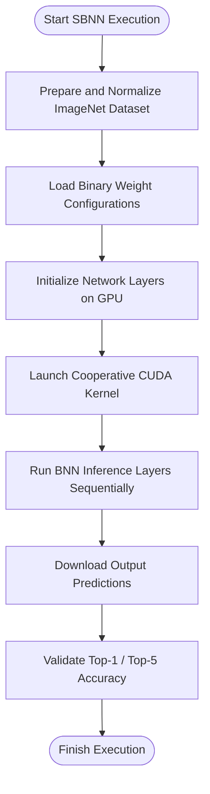

# Running Large-Scale ImageNet Models (AlexNet and ResNet-18)

This guide provides a comprehensive workflow for executing SBNN's implementation of AlexNet and ResNet-18 models on the ImageNet dataset. It will help you preprocess data correctly, configure the networks with large binary weight files, benchmark performance, and validate output accuracy using Top-1 and Top-5 metrics.

---

## 1. Workflow Overview

### Objective
Run and validate the AlexNet or ResNet-18 binarized neural networks on the ImageNet dataset using the SBNN framework, achieving reliable output accuracy while benchmarking GPU performance.

### Prerequisites
- A compatible NVIDIA GPU supporting CUDA (refer to the [System Requirements](../getting-started/prerequisites-installation/system-requirements) document).
- SBNN installed and compiled (see [Installation Guide](../getting-started/prerequisites-installation/installing-sbnn)).
- ImageNet dataset downloaded and preprocessed according to SBNN’s normalization scheme (details below).
- Pre-trained binary weight files located in the `pytorch_training` directory.
- Basic familiarity with command-line build and run operations.

### Expected Outcome
- Successful execution of the binarized AlexNet or ResNet-18 models on ImageNet batches.
- Performance metrics including timing for GPU kernel execution.
- Output predictions validated against true labels with Top-1 and Top-5 accuracies reported.

### Estimated Time
About 15–30 minutes depending on system setup and data preparation.

### Difficulty
Intermediate: Requires understanding of CUDA program execution flows and basic GPU configuration.

---

## 2. Step-by-Step Instructions

### Step 1: Prepare the ImageNet Dataset

1. The SBNN expects images preprocessed with RGB channel normalization to match PyTorch standards.
2. Use the provided C++ function `read_ImageNet_normalized` or your custom script to normalize images by resizing the smaller edge to 256, center cropping to 224x224, and applying channel normalization.
3. Create an `imagenet_files.txt` listing the image files to process.
4. Ensure the `imagenet_files.txt` path is accurate relative to where the executable runs.

<Tip>
Accurate normalization is critical. Improper preprocessing will cause validation to show poor accuracy despite correct code execution.
</Tip>

### Step 2: Configure and Build the Model Executable

1. Choose the model you want to run:
   - **AlexNet:** Use the `alexnet.cu` file.
   - **ResNet-18:** Use the `imagenet_resnet.cu` file.
2. Adjust the device number and batch size inside the code if needed (default device is 6 for AlexNet, 6 for ResNet).
3. Update the model weight configuration file path:
   - AlexNet uses `./pytorch_training/alexnet_imagenet.csv`
   - ResNet-18 uses `./pytorch_training/resnet_imagenet.csv`
4. Use the provided Makefile to build binaries:

```bash
make alexnet
make imagenet_resnet
```

<Tip>
By default, the SBNN uses the SBNN-32 or SBNN-64 implementation selected inside the source `main()` function by toggling `main32()` or `main64()` calls.
</Tip>

### Step 3: Launch the Model Execution

Run the compiled executable from the command line:

```bash
./alexnet
# or
./imagenet_resnet
```

The program performs these major actions:
- Loads normalized ImageNet images and true labels in batches (default batch size: 32).
- Reads and binarizes the network weights from the CSV configuration files.
- Initializes all network layers, including convolutional and fully connected layers.
- Executes the entire binarized network inside a single cooperative CUDA kernel.
- Measures and reports kernel execution time.
- Downloads output predictions from GPU to host memory.
- Validates predictions against true labels using Top-1 and Top-5 metrics.

<Tip>
Make sure the device id matches your available GPU, particularly if running multiple CUDA devices on one machine.
</Tip>

### Step 4: Validate Output Accuracy

After execution, observe the terminal output for validation results. Expect metrics similar to:

```
Top-1 Accuracy: XX.XX%
Top-5 Accuracy: XX.XX%
```

This confirms your model replicated the expected inference results corresponding to published SBNN benchmarks.

<Note>
Batch size determines throughput and GPU utilization efficiency. The default 32 is reasonable for common GPU memory configurations.
</Note>

### Optional: Profiling and Kernel Timing

The executable times the kernel execution using CUDA events and reports the timing in milliseconds. Use this to evaluate real GPU workload performance.

---

## 3. Detailed Configuration Notes

### Handling Large Binary Weight Files

- The weight CSV files for ImageNet models are large due to deep layer complexity.
- The code reads weights sequentially for each layer, initializing specific layer parameter objects.
- Layer objects initialize device memory and binarize weights for fast GPU inference.

### Batch Size and Image Dimensions

- The ImageNet input expects 224x224 images with 3 channels.
- Batch size should be set consistent across all layers.

### GPU Kernel Launch Parameters

- Uses cooperative kernel launch with max occupancy configuration.
- Typical thread count is 1024 per block.
- Shared memory allocation is dynamically set to accommodate large layers.

---

## 4. Common Pitfalls and Troubleshooting

<AccordionGroup title="Troubleshooting Large-Scale ImageNet Model Execution">
<Accordion title="CUDA Device Not Found or Invalid Device ID">
Verify your system GPU devices with `nvidia-smi`. Update the device index in the source code with a valid GPU id before building.
</Accordion>
<Accordion title="Dataset Path Errors or Image Loading Failures">
Check that the `imagenet_files.txt` exists and points to valid image files. Confirm normalization is performed as expected.
</Accordion>
<Accordion title="Weight File Not Found or Incorrect Path">
Ensure the CSV weight configuration files are in the specified path `./pytorch_training/`. Modify the path string in the source code if needed.
</Accordion>
<Accordion title="Out-of-Memory Errors on GPU">
Reduce batch size or confirm GPU has enough memory for execution. Nvidia tools can check current GPU usage.
</Accordion>
<Accordion title="Low Accuracy Validation">
Verify data preprocessing normalization matches PyTorch’s scheme exactly. Also confirm you are running the correct binary weights matching the chosen model.
</Accordion>
</AccordionGroup>

---

## 5. Best Practices and Tips

- Prefetch and preprocess ImageNet batches offline to reduce runtime overhead.
- Use the batched kernel launch (`main64()`) when available for improved load balancing.
- Monitor and tune batch size to avoid GPU under-utilization or memory exhaustion.
- Validate output on small batches before scaling up.
- Comment and uncomment `main32()` / `main64()` calls to switch between 32-bit and 64-bit binary implementations.

---

## 6. Example Workflow for Running ResNet-18 on ImageNet

```cpp
// Select device
int dev = 6;
cudaSetDevice(dev);

// Prepare batch parameters
const unsigned batch = 32;
const unsigned output_size = 1000;
const unsigned image_height = 224;
const unsigned image_width = 224;
const unsigned image_channel = 3;

// Allocate memory for input images and labels
float* images = (float*)malloc(batch * image_height * image_width * image_channel * sizeof(float));
unsigned* labels = (unsigned*)malloc(batch * sizeof(unsigned));

// Load and normalize images + labels
read_ImageNet_normalized("./imagenet_files.txt", images, labels, batch);

// Open weight config file
FILE* config_file = fopen("./pytorch_training/resnet_imagenet.csv", "r");

// Initialize each network layer with weights and inputs (see full code in imagenet_resnet.cu)
// ... (create layer objects, initialize weights, bind GPU buffers)

// Prepare kernel launch parameters and cooperative kernel call
// ...

// Launch kernel
cudaLaunchCooperativeKernel(...);

// Download output from GPU
float* output = bout->download_output();

// Validate prediction
validate_prediction(output, labels, output_size, batch);

// Free allocated resources
// ...
```

---

## 7. Next Steps and Related Documentation

- Review [Dataset Preparation & Verification](../getting-started/run-validate/dataset-preparation) for detailed image normalization workflows.
- For initial onboarding, see [Running Your First BNN Example](../getting-started/run-validate/running-models).
- Explore [Choosing Between SBNN-32 and SBNN-64](../../guides/advanced-usage-optimization/sbnn32-vs-sbnn64) to understand performance and accuracy tradeoffs.
- Learn kernel optimization strategies in [Optimizing Performance with Cooperative GPU Kernels](../../guides/advanced-usage-optimization/kernel-cooperative-groups).

---

## 8. Additional Resources

- Explore the [alexnet.cu](https://github.com/uuudown/SBNN/blob/main/alexnet.cu) and [imagenet_resnet.cu](https://github.com/uuudown/SBNN/blob/main/imagenet_resnet.cu) source files for implementation details.
- The [README.md](https://github.com/uuudown/SBNN/blob/main/README.md) contains foundational background and usage hints.


---

# Summary
This guide empowers users to run SBNN's large-scale ImageNet models AlexNet and ResNet-18, handling intricate configuration and efficient GPU kernel execution. With emphasis on correct data preparation, weight integration, and validation, users can replicate published high-performance BNN results effectively.

---

# Frequently Asked Questions

<AccordionGroup title="FAQ">
<Accordion title="Can I run the models with a batch size other than 32?">
Yes. You can adjust the batch size in the source code for your available GPU memory. Smaller batches may impact performance.
</Accordion>
<Accordion title="How to switch between SBNN-32 and SBNN-64 implementations?">
In the main file of the source, toggle calls between `main32()` and `main64()` before building.
</Accordion>
<Accordion title="What if the accuracy validation reports low numbers?">
Verify dataset normalization, weight file correctness, and ensure you run the intended model binary.
</Accordion>
</AccordionGroup>

---

# Diagram: High-Level Execution Flow for Running ImageNet Models



---

If you encounter any issues during execution, consult [Troubleshooting Common Setup Issues](../getting-started/run-validate/troubleshooting-common-issues) for diagnostic guidance.


---

*End of Guide for Running Large-Scale ImageNet Models (AlexNet and ResNet-18)*
