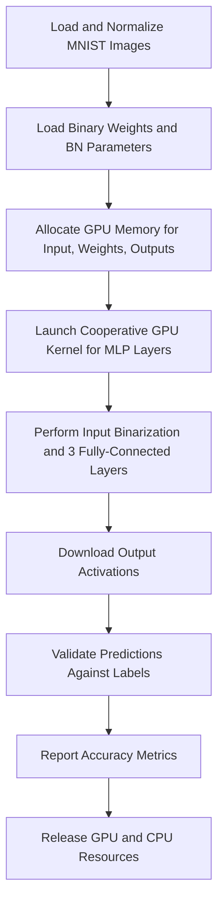

# Classifying Digits with MNIST MLP

## Overview
This guide walks you through running the Singular Binarized Neural Network (SBNN) framework on the classic MNIST digit classification task using a 4-layer multilayer perceptron (MLP). You will learn how to prepare your data, configure the model for either 32-bit or 64-bit binarized inference, execute the inference kernel, and validate the classification results. This tutorial is crafted for users new to GPU-based binarized neural networks (BNNs), helping you achieve your first successful MNIST digit classification using SBNN.

---

## What You Will Achieve
- Load and preprocess MNIST dataset for SBNN
- Configure the 4-layer MLP model with binary weights and batch normalization
- Select and run inference using SBNN-32 or SBNN-64 implementation
- Validate prediction accuracy against known labels

## Prerequisites
- An NVIDIA GPU compatible with CUDA compute capability 7.0 or higher
- CUDA Toolkit installed and environment set up properly
- SBNN framework built and configured
- MNIST dataset files downloaded locally and accessible (t10k-images-idx3-ubyte and t10k-labels-idx1-ubyte)
- Access to the pre-trained weight files (e.g., `mlp_mnist.csv`) in your working path

## Expected Outcome
Upon completion, you will have executed an end-to-end inference of the SBNN 4-layer MLP on a batch of MNIST test images, with output showing classification accuracy. You will understand how to configure and launch the SBNN kernels and retrieve results successfully.

## Time Estimate
~15-30 minutes depending on environment setup and familiarity with CUDA and running GPU binaries.

## Difficulty Level
Beginner: no prior BNN experience required, some familiarity with running GPU programs assumed.

---

# Step-by-Step Instructions

### 1. Prepare MNIST Dataset
- Obtain MNIST test images and labels from the official source or your local mirror.
- Ensure the files are named and located as expected, e.g.,:
  - `/home/lian599/data/mnist/t10k-images-idx3-ubyte`
  - `/home/lian599/data/mnist/t10k-labels-idx1-ubyte`
- The data loading function `read_MNIST_normalized()` expects these paths to load and normalize images appropriately.

<Tip>
Normalization scales pixel values to a floating-point format around zero, matching PyTorch preprocessing. This ensures consistency and correctness of input data representation.
</Tip>


### 2. Configure the Model in Source Code
- Locate the source file `mnist_mlp.cu`.
- In the `main32()` or `main64()` function, update parameters as needed:
  - `dev`: CUDA device number (e.g., 7 or 5)
  - `batch`: number of images to process simultaneously (default 1024)
  - `config_file`: path to the binary weight CSV file (e.g., `mlp_mnist.csv`)

- Input dimensions are set to 28 x 28 pixels per image, suitable for MNIST.
- Hidden layer size defaults to 1024 units.

### 3. Choose Between SBNN-32 and SBNN-64 Implementations
- SBNN-32 and SBNN-64 differ in processing granularity with 32-bit vs. 64-bit lane workloads.
- To run 32-bit version, uncomment `main32()` in `main()`, and comment out `main64()`.
- For 64-bit variant, use `main64()` and comment out `main32()`.

<Note>
Selecting the correct kernel depends on your GPU architecture and batch size. SBNN-32 typically offers better bit-matrix multiplication for smaller workloads, while SBNN-64 can excel in other cases. Refer to the 'Choosing Between SBNN-32 and SBNN-64' guide for detailed analysis.
</Note>

### 4. Build the SBNN Binary
- Use the provided Makefile by running:
  ```
  make mnist_mlp
  ```
- Verify successful compilation without errors.

### 5. Run the Inference
- Execute the compiled binary:
  ```
  ./mnist_mlp
  ```
- The program reads MNIST images, loads the binary weights and batch normalization parameters, allocates GPU memory, and launches the CUDA cooperative kernel.
- Kernel execution performs input binarization, three fully-connected binary layers, and produces the output logits.

<Tip>
CUDA cooperative kernels allow synchronizing across GPU blocks to efficiently fuse the entire MLP inference in a single kernel launch, minimizing overhead.
</Tip>

### 6. Validate Output
- After kernel execution, the program downloads the output from GPU memory.
- It compares predictions with true labels and prints classification accuracy metrics (such as Top-1 accuracy).

### 7. Clean up Resources
- The code releases all allocated GPU and CPU memory automatically on completion.
- No additional clean-up is required.

---

# Example Code Snippet

Below is the snippet illustrating the 32-bit main inference flow excerpt:

```cpp
int main32()
{
    int dev = 7;
    cudaSetDevice(dev);

    const unsigned batch = 1024;
    const unsigned output_size = 10;
    const unsigned n_hidden = 1024;
    const unsigned image_height = 28;
    const unsigned image_width = 28;
    const unsigned image_size = image_height*image_width;

    // Load input images and labels
    float* images = (float*)malloc(image_size*batch*sizeof(float));
    unsigned* image_labels = (unsigned*)malloc(batch*sizeof(unsigned));
    read_MNIST_normalized("/home/lian599/data/mnist/t10k-images-idx3-ubyte", 
                           "/home/lian599/data/mnist/t10k-labels-idx1-ubyte", 
                           images, image_labels, batch);

    // Load model weights
    FILE* config_file = fopen("../pytorch/BinaryNet/mlp_mnist.csv", "r");

    // Initialize network layers
    In32LayerParam* bin = new In32LayerParam("Fin", batch, image_size);
    In32LayerParam* bin_gpu = bin->initialize(images);
    Fc32LayerParam* bfc1 = new Fc32LayerParam("Fc1", batch, image_size, n_hidden); 
    Fc32LayerParam* bfc1_gpu = bfc1->initialize(config_file, bin->get_output_gpu());
    Fc32LayerParam* bfc2 = new Fc32LayerParam("Fc2", batch, n_hidden, n_hidden); 
    Fc32LayerParam* bfc2_gpu = bfc2->initialize(config_file, bfc1->get_output_gpu());
    Fc32LayerParam* bfc3 = new Fc32LayerParam("Fc3", batch, n_hidden, n_hidden); 
    Fc32LayerParam* bfc3_gpu = bfc3->initialize(config_file, bfc2->get_output_gpu());
    Out32LayerParam* bout = new Out32LayerParam("Fout", batch, n_hidden, output_size, true);
    Out32LayerParam* bout_gpu = bout->initialize(config_file, bfc3->get_output_gpu());

    // Launch kernel
    int numThreads = 1024;
    cudaDeviceProp deviceProp;
    cudaGetDeviceProperties(&deviceProp, dev);
    int numBlocksPerSm;
    cudaOccupancyMaxActiveBlocksPerMultiprocessor(&numBlocksPerSm, mnist_mlp32, numThreads, 0);
    void* args[] = {&bin_gpu, &bfc1_gpu, &bfc2_gpu, &bfc3_gpu, &bout_gpu};

    START_TIMER;
    cudaLaunchCooperativeKernel((void*)mnist_mlp32, numBlocksPerSm*deviceProp.multiProcessorCount, numThreads, args);
    STOP_TIMER;

    // Validate output
    float* output = bout->download_output();
    validate_prediction(output, image_labels, output_size, batch);

    // Cleanup
    delete bin;
    delete bfc1;
    delete bfc2;
    delete bfc3;
    delete bout;
    return 0;
}
```

---

# Troubleshooting & Tips

### Common Issues
- **GPU Device Not Found:** Verify your CUDA device ID matches your system.
- **File Path Errors:** Check that MNIST data and weight CSV files exist at specified paths.
- **Compilation Failures:** Confirm CUDA Toolkit version and GPU architecture flags in the Makefile.
- **Memory Allocation Failures:** Reduce batch size if GPU memory is insufficient.
- **Incorrect Output or Accuracy:** Ensure proper normalization of input images, consistent with PyTorch preprocessing.

### Best Practices
- Profile GPU utilization to ensure kernels are launched with optimal thread/block sizing.
- Use the batched versions of layers within kernels for better load balancing on small batch sizes.
- Start with smaller batch sizes during early validation to speed up iteration.

### Performance Considerations
- The kernel uses cooperative groups to synchronize across blocks, so ensure your GPU supports this feature.
- The number of threads and blocks per multiprocessor is auto-configured; adjusting it may improve performance on some GPUs.

---

# Next Steps & Related Content

- After successfully running this workflow, explore CIFAR-10 image classification with VGG and ResNet models to understand convolutional BNNs.
- Learn about SBNN-32 vs. SBNN-64 trade-offs in the "Choosing Between SBNN-32 and SBNN-64" guide.
- Dive deeper into CUDA cooperative kernels in the "Optimizing Performance with Cooperative GPU Kernels" guide.
- For dataset preparation, refer to "Dataset Preparation & Verification" to ensure input normalization consistency.

---

# Additional Resources
- [SBNN GitHub Repository](https://github.com/uuudown/SBNN)
- [MNIST Dataset](http://yann.lecun.com/exdb/mnist/)
- [CUDA Documentation](https://docs.nvidia.com/cuda/)

---

# File References
- `mnist_mlp.cu` - Source implementation of the 4-layer MLP for MNIST.
- `sbnn32_param.h` - Definitions for 32-bit layer parameters used.
- `sbnn32.cuh` - CUDA device functions for layer operations.
- `data.h` and `data.cpp` - Data loading and normalization utilities.


---

# Summary Diagram: Inference Flow



This diagram illustrates the sequential process from loading data to final classification output within the SBNN inference workflow for MNIST.

---