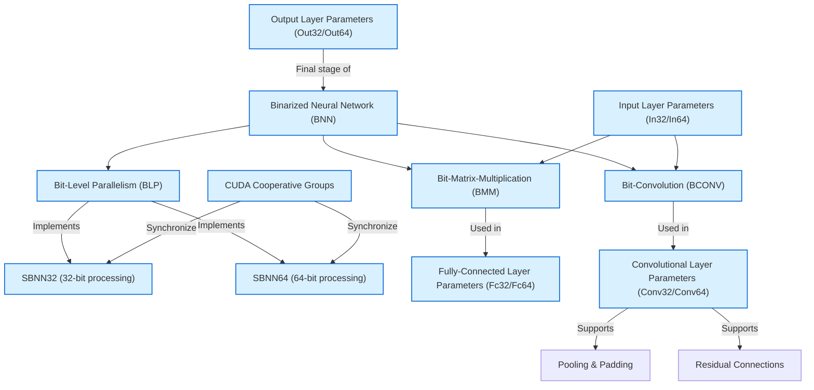

# Core Concepts & Terminology

Welcome to the foundational guide of SBNN, your essential resource for understanding the core terms and building blocks that underpin this GPU-centric binarized neural network framework. Mastering these concepts will empower you to navigate advanced configurations and optimize your deployment of SBNN effectively.

---

## Why This Matters

SBNN leverages bit-level parallelism and binary representations to accelerate neural network inference efficiently on GPUs. Grasping the specialized terminology such as Binarized Neural Network (BNN), Bit-Level Parallelism (BLP), and key implementation details like SBNN32/SBNN64 variants, Bit-Matrix-Multiplication (BMM), and Bit-Convolution (BCONV) will:

- Equip you with a clear mental model of how SBNN achieves high performance and low memory footprint.
- Help you understand how different layers and components interact in the SBNN pipelines.
- Prepare you to customize, troubleshoot, and optimize your use of the framework.

---

## Key Concepts and Terminology

### 1. Binarized Neural Network (BNN)
BNNs transform the conventional neural network weights and activations into binary values, specifically `+1` or `-1`. This allows for highly efficient bitwise operations instead of floating-point arithmetic, significantly reducing memory usage and computation time.

**User Perspective:** When running inference with SBNN, the network operates on binary data packed into GPU-friendly formats, enabling ultra-fast, parallel bitwise calculations.

---

### 2. Bit-Level Parallelism (BLP)
BLP refers to the capability to perform multiple operations simultaneously at the individual bit level within GPU warps. SBNN exploits this principle by packing multiple binary values into machine words and processing them in parallel.

**Example:** In a warp of 32 threads, each thread processes a 32-bit or 64-bit integer representing multiple binarized neurons, thus achieving significant throughput.

---

### 3. SBNN32 and SBNN64
These denote two implementation variants of the SBNN framework:

- **SBNN32:** Uses 32-bit unsigned integers for bit packing and parallel processing.
- **SBNN64:** Uses 64-bit unsigned long long integers, processing a larger chunk of bits per lane.

**How it Impacts You:**
- For fully-connected layers (BMM), SBNN32 often outperforms due to better alignment with 32-bit operations.
- For convolutional layers (BCONV), SBNN64 typically yields better performance with 64-bit processing.

This choice allows users to tailor the implementation to their model architecture for optimal results.

---

### 4. Bit-Matrix-Multiplication (BMM)
BMM is a specialized matrix multiplication operation optimized for binary data. Instead of floating-point multiply-accumulate, BMM uses bitwise XOR and population count (`popc`) instructions to quickly compute dot products.

**User Story:** When your model includes fully-connected layers, SBNN packs weights and activations into bits and uses BMM kernels to perform inference swiftly and efficiently.

---

### 5. Bit-Convolution (BCONV)
BCONV adapts convolution operations to binary inputs and weights, using bitwise arithmetic. SBNN supports standard convolution parameters such as stride, padding, and pooling, maintaining flexibility without sacrificing the benefits of binarization.

**Why You Care:**
- If deploying binarized CNN models (e.g., AlexNet, VGG, ResNet), the BCONV kernels in SBNN enable these layers to compute faster on GPUs.
- SBNN supports input layers without binarization for preserving image quality before binarized processing starts.

---

### 6. Cooperative Groups in GPU Kernels
SBNN kernels frequently utilize [CUDA Cooperative Groups](https://docs.nvidia.com/cuda/cuda-c-programming-guide/index.html#cooperative-groups) to synchronize threads efficiently. This is key for intra-kernel fusion, enabling entire networks or stages to execute as a single GPU kernel for maximum performance.

**Benefit:**
- Minimizes costly kernel launch overhead.
- Ensures coordinated parallelism and synchronization within GPU threads during BMM and BCONV.

---

### 7. Model Granularity and Layer Parameter Classes
SBNN organizes binary layers into classes reflecting their granularity and bit-width:

- **Input Layer Parameters:** `In32LayerParam`, `In64LayerParam` — handle preprocessing binarization and packing of inputs.
- **Fully-Connected Layer Parameters:** `Fc32LayerParam`, `Fc64LayerParam` — manage weight binarization, batch normalization, and output storage.
- **Convolutional Layer Parameters:** `In32Conv32LayerParam`, `Conv32LayerParam`, `In32Conv64LayerParam`, `Conv64LayerParam` — encapsulate convolution-specific dimensions, binarization, pooling, residuals, and GPU data pointers.
- **Output Layer Parameters:** `Out32LayerParam`, `Out64LayerParam` — handle final weight application and result unpacking.

**Practical Tip:** When configuring your model, select the appropriate parameter class version matching your bit-width preference and layer type.

---

## Real-World Usage Scenarios

- **ImageNet Inference:** SBNN's `alexnet32` and `alexnet64` kernels demonstrate how binarized networks are built from input layers through multiple convolutional and fully connected layers, culminating in output layers with batch normalization.
- **ResNet and VGG Models:** By leveraging `Conv32LayerParam` and `Conv64LayerParam` structures, users implement deep, complex networks optimized for GPU bitwise processing.
- **MNIST MLP:** Simple multi-layer perceptrons also benefit from efficient binarized layers using 32 or 64-bit implementations.

Your model's configuration files (CSV format) feed parameters into these classes to initialize weights and thresholds, allowing plug-and-play execution across tasks.

---

## Summary Diagram of Key Terminology Relationships

---

## Practical Tips and Best Practices

- **Choosing SBNN32 vs. SBNN64:** Decide based on your layer types and model architecture. Use SBNN32 for fully-connected heavy models; prefer SBNN64 for convolution-dominant models.
- **Layer Initialization:** Always initialize layer parameter objects with your model's weight and batch normalization CSV files before running inference.
- **Memory Management:** Use provided methods to allocate, upload, and download GPU buffers carefully to avoid memory leaks or crashes.
- **Batch Normalization:** Enable batch normalization in output layers to improve accuracy without compromising the binarization speed.
- **Residual Handling:** When your network uses residual connections, configure convolution parameters to save and inject residuals properly for accuracy and performance.

---

## Troubleshooting Common Issues

<AccordionGroup title="Common Challenges and Solutions">
<Accordion title="Incorrect Output After Initialization">
Ensure all weights and batch-normalization parameters are correctly loaded from your configuration files. Missing or malformed CSV files will lead to silent failures or invalid outputs.
</Accordion>
<Accordion title="GPU Memory Allocation Failures">
Verify proper release of GPU memory upon layer destruction. Use the `release()` method in layer parameter classes and check for CUDA errors.
</Accordion>
<Accordion title="Mismatched Bit-Widths Between Layers">
Mixing 32-bit and 64-bit layers without proper interfaces can cause data alignment issues. Stick to consistent bit-width implementations per run, or carefully bridge data manually.
</Accordion>
</AccordionGroup>

---

## Next Steps

Once you are comfortable with this terminology foundation:

- Explore the [What is SBNN?](../introduction-core-concepts/what-is-sbnn) page for a broader understanding of the framework.
- Consult the [Choosing Between SBNN-32 and SBNN-64](../../guides/advanced-usage-optimization/sbnn32-vs-sbnn64) guide to decide the best implementation for your use case.
- Move on to configuration and model setup to see how these core concepts translate into practical application.

---

## Additional Resources

- [SBNN Github Repository](https://github.com/uuudown/SBNN)
- CUDA Cooperative Groups documentation
- SBNN Paper: *BSTC: A Novel Binarized-Soft-Tensor-Core Design for Accelerating Bit-Based Approximated Neural Nets (SC'19)*

---

You are now equipped with the critical vocabulary to successfully engage with, deploy, and optimize SBNN in your projects. Keep this page handy as you progress through your SBNN journey.