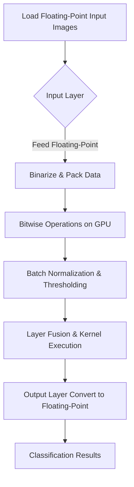

# What is SBNN?

## Unlocking Ultrafast Neural Network Inference on GPUs with Bit-Level Precision

SBNN stands for Singular Binarized Neural Network — a cutting-edge neural network inference framework designed to maximize GPU efficiency by harnessing the power of bit-level operations. Unlike traditional deep neural networks (DNNs) that rely on floating-point calculations, SBNN operates predominantly on binary values, leading to ultra-efficient computations and significantly reduced memory usage.

### Why SBNN Matters

Modern GPU architectures are optimized for word-based data processing, which creates fundamental challenges for implementing bit-based neural networks. SBNN breaks these barriers by introducing a novel software-hardware co-design approach that unlocks bit-level parallelism at scale. This innovation fuels remarkable gains in throughput and energy efficiency, enabling practical deployment of binarized neural networks (BNNs) in high-performance computing (HPC), cloud, and edge computing environments.

### Defining SBNN in Simple Terms

SBNN is a neural network inference system focused on executing binarized neural networks where weights and activations are represented as bits (0s and 1s) rather than floating-point numbers. This representation compresses the data drastically and replaces costly multiply-accumulate operations with lightweight bitwise operations, mainly XOR and population count (popcount). The outcome is a GPU-centric framework that optimally synchronizes its kernel operations to fully exploit GPU cores, even when processing small batches.

### What SBNN Enables You to Do

- Run binarized deep neural networks efficiently on GPUs without sacrificing accuracy.
- Accelerate inference tasks by leveraging bit-level parallelism, drastically reducing latency.
- Achieve minimal memory footprints through compact representation of weights and activations.
- Integrate BNN inference workflows smoothly into HPC, cloud, and edge applications.

### What Makes SBNN Unique

- **Bit-Level Software-Hardware Codesign:** SBNN’s binarized-soft-tensor-core is a novel construct that emulates hardware bit manipulation capabilities within software kernels, effectively bridging the divide between word-based GPU architectures and bit-based BNN algorithms.
- **Intra- and Inter-Layer Fusion Techniques:** These optimizations pack entire BNN inference execution sequences into a single GPU kernel launch, eliminating costly kernel invocations and maximizing core utilization.
- **Support for 32-bit and 64-bit Granular Workloads:** SBNN implements two variants, SBNN-32 and SBNN-64, tuned respectively for bit-matrix-multiplication and bit-convolution performance, giving users flexibility based on their model and use case.
- **Validated Against Concrete Models and Datasets:** Researchers and practitioners can find full implementations of SBNN applied to popular architectures like AlexNet, ResNet-18, and VGG-like models, verified on benchmark datasets such as MNIST, CIFAR-10, and ImageNet.

### At a Glance: How SBNN Works

SBNN converts floating-point neural network weights and inputs into compressed bit-packed formats to minimize memory usage. It then performs neural network operations using bitwise instructions (XOR, popcount) that GPUs can execute extremely fast in parallel. Batch normalization thresholds are applied to binarize outputs efficiently. Layer fusion is utilized to run sequences of layers in one combined kernel to reduce overhead and latency.

## Core Capabilities

- **Bit-Matrix Multiplication (BMM):** Efficient matrix multiplication using 32-bit packed vectors perfect for fully-connected layers.
- **Bit-Convolution (BCONV):** Accelerated convolution operations using 64-bit lane processing optimized for convolutional layers.
- **Image Preprocessing Utilities:** C++ routines for reading and normalizing images from MNIST, CIFAR-10, and ImageNet datasets.
- **Flexible Layer Parameter Classes:** Layer parameters encapsulated with support for GPU memory management and data unpacking for inspection.
- **Cooperative GPU Kernel Launches:** Use of CUDA cooperative groups for synchronized execution and intra-kernel communication.

## Real-World Scenario

Imagine deploying an image classification model on a resource-limited edge device or GPU cluster with strict latency and power constraints. SBNN enables you to run binarized versions of standard models (ResNet, AlexNet) with impressive speedups and memory savings without rewriting your codebase extensively. This means faster inferences, reduced operational costs, and expanded deployment opportunities.

## Quick Example: Running a Binarized AlexNet Inference on GPU

Using SBNN’s provided classes and kernels, the process involves:

1. Loading and normalizing ImageNet images into floating-point arrays.
2. Initializing SBNN layer parameters for convolutional and fully connected layers with pre-trained binary weights.
3. Uploading data to GPU memory using provided interfaces.
4. Launching a cooperative kernel (`alexnet32` or `alexnet64`) that processes the entire network in a synchronized fashion.
5. Downloading and validating the output classification results.

This pipeline lets users harness cutting-edge binarized inference effortlessly.

---

## Practical Tips & Insights

- **Choosing Between SBNN-32 vs SBNN-64:** SBNN32 shines for fully connected layers (bit-matrix multiplication), while SBNN64 is better optimized for convolutional layers. Choose based on your model’s architecture and profiling.
- **Batch Size Considerations:** The framework is designed to maintain high GPU core utilization even for small batch sizes, overcoming a common bottleneck for GPU-based BNNs.
- **Input Binarization:** The input layer typically keeps floating-point values for richer feature representation, while deeper layers apply binarization aggressively for efficiency.
- **Kernel Launch Fusion:** Fusing layer operations into a single kernel helps reduce launch overhead and synchronizes memory usage, crucial for maximizing inference speed.

---

## Troubleshooting & Common Pitfalls

- Ensure that the NVCC architecture flag (`sm_xx`) matches your GPU hardware to avoid compatibility issues.
- Validate that input data paths and weight configuration files are correctly set before running examples.
- Memory allocation failures generally indicate incorrect input dimensions or configuration mismatches.
- Use provided image reading utilities to verify preprocessing correctness against known baselines like PyTorch.

---

For full source code, model configurations, and training scripts (to be released), visit the official repository.

---

[Source Repository on GitHub](https://github.com/uuudown/SBNN)

[Full SBNN SC-19 Paper](https://doi.org/10.1145/3295500.3356169)

---

<Callout title='About SBNN'>
SBNN delivers a unique, GPU-accelerated binarized neural network inference framework designed to bring bit-level computation benefits into mainstream HPC, cloud, and edge applications.
</Callout>

---

### Diagram: Simplified SBNN Inference Flow

---

Explore the rest of the documentation series to dive deeper into system architecture, model support, detailed workflows, and optimization techniques.

