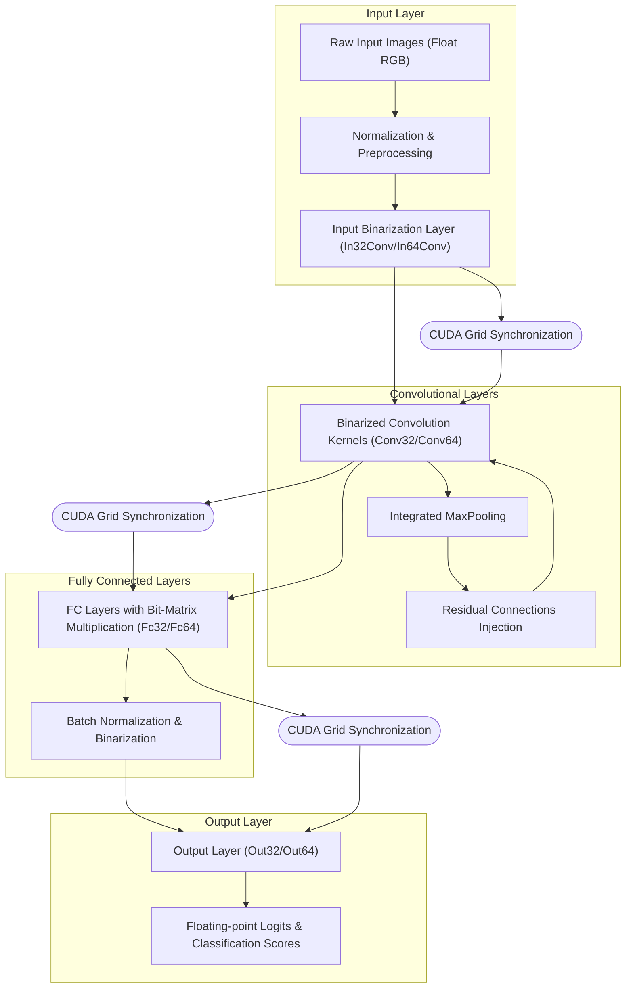

# System Architecture Overview

## Unlocking the Power of Binarized Neural Networks on GPUs

At the core of SBNN lies an innovative system architecture designed to fully leverage GPU capabilities for binarized neural network (BNN) inference. This page reveals how SBNN orchestrates optimized CUDA kernels, bit-level operations, and efficient data flows to deliver unprecedented speed and efficiency, providing a clear window into the inner workings without overwhelming you with implementation minutiae.

---

## Understanding SBNN's Architecture

SBNN integrates tightly optimized CUDA kernels responsible for executing binarized layers, managing the interplay of bit-matrix multiplication and bit-convolution operations. This approach translates traditional neural network computations into highly parallel, low-memory bitwise computations that saturate modern GPUs even at small batch sizes.

### Core Architectural Components

- **Binarized CUDA Kernels:** Specialized device functions implementing binarized input layers, convolutional layers, fully connected layers, and output layers for both 32-bit and 64-bit lane granularity.
- **Layer Param Classes:** Parameter classes encapsulate vital layer metadata like input/output dimensions, filter configurations, batch sizes, and GPU memory pointers facilitating seamless kernel invocation and data management.
- **Data Flow Pipeline:** Input data (images or other tensors) undergo normalization and binarization, feeding through stacked conv and fully connected layers, culminating in an output layer generating prediction scores.
- **Bit-Level Parallelism:** Each GPU warp lane processes packed 32-bit or 64-bit words, unleashing massive parallelism by applying warp-level intrinsic operations like ballot, shuffle, and population count for efficient bitwise arithmetic.

### How SBNN Transforms Neural Network Computations

Traditional floating-point operations are replaced with bitwise logic, enabling ultra-fast processing:

1. **Input Layer Binarization:** Inputs are converted from floating-point values into compact binary representations.
2. **Convolutional and Fully-Connected Layers:** Computations utilize bit-matrix multiplication (BMM) where weights and activations are stored as packed bits. Batch normalization operates alongside to scale and threshold intermediate results.
3. **Pooling & Residual Connections:** Incorporated directly into convolution layers, including max pooling (e.g., 2x2) and residual feature injections to boost accuracy.
4. **Output Layer:** Produces floating-point logits with optional batch normalization to finalize predictions.

<Tip>
This design unlocks GPU bit-level parallelism, ensuring high compute efficiency on large models like VGG, ResNet, and AlexNet for datasets such as ImageNet, CIFAR-10, and MNIST.
</Tip>

---

## Key Kernels and Data Flows

Below is a simplified explanation of the data flow and kernel execution workflow within SBNN, illustrated with primary operations across a binarized ResNet-18 as an example.

### Layer Invocation Sequence

- The process starts with **Input Binarization Kernel** (`In32Conv32Layer` or `In32Conv64Layer`), converting RGB input images into binary format while preserving critical info through float normalization.

- **Convolutional Layers (`Conv32Layer` or `Conv64Layer`)** follow sequentially, applying binarized filters over binary activation maps. These may incorporate:
  - Stride and padding configuration to align spatial dimensions.
  - Optional 2x2 max-pooling directly within kernel logic.
  - Residual feature injection leveraging previously computed feature maps.

- Upon completing convolutional stages, **Fully Connected Layers (`Fc32Layer`, `Fc64Layer`)** perform bit-matrix multiplication with binarized inputs and weights, accompanied by batch normalization and binarization.

- The final **Output Layer** computes floating-point logits through a bit-matrix multiplication combined with batch normalization, preparing the data for subsequent classification.

### Synchronization & Parallel Execution

The entire neural network workflow is orchestrated using CUDA cooperative groups, allowing:

- Synchronization points between layer kernels to ensure correctness.
- Launch of kernels as a single cooperative kernel grid for high GPU occupancy.

---

## Practical Insights: Why does this matter?

This architecture maximizes GPU utilization at the warp level, avoiding common bottlenecks in BNN inference:

- It addresses the mismatch of bit-based algorithms running on word-based architectures by packing computations into warp-level 32-bit or 64-bit units.
- Fine-grained bit parallelism enables sustained throughput even with small batch sizes, a key advantage for real-time inference.
- By embedding pooling and residual injections inside convolution kernels, it minimizes costly intermediate memory reads/writes, enhancing performance.

---

## Visualization of SBNN System Architecture

---

## Best Practices & Tips

- Use the batched versions of input and FC layers (`In32LayerBatched`, `Fc32LayerBatched`) to enhance load balancing when dealing with small batch sizes.
- Configure residual injections carefully to leverage improved model accuracy without unnecessary computational overhead.
- Consider your target GPU architecture (compute capability) when selecting 32-bit vs 64-bit granularity implementations for ideal performance.
- Use the cooperative kernel approach to execute entire network inference in a single kernel launch, minimizing kernel launch overhead.

---

## Troubleshooting Common Issues

<AccordionGroup title="Common Troubleshooting Topics">
<Accordion title="Low GPU Utilization">
Check if batch size is too small; switching to batched kernel versions can help maintain high GPU occupancy.
</Accordion>
<Accordion title="Output Accuracy Does Not Match" >
Verify input data normalization procedures and weight loading. Use provided validation utilities to compare results against expected outputs.
</Accordion>
<Accordion title="Memory Allocation Failures">
Confirm sufficient GPU memory availability and correct batch sizes for input and output buffers.
</Accordion>
<Accordion title="Kernel Launch Errors">
Ensure CUDA device properties match required compute capabilities and shared memory configurations are within limits.
</Accordion>
</AccordionGroup>

---

## Next Steps

To begin using SBNN effectively:

- Review [Supported Models & Datasets](../supported-models-datasets) to understand available pretrained BNN architectures.
- Follow the [Configuration & Model Setup](../../getting-started/prerequisites-installation/configuration-basics) guide to prepare your environment.
- Dive into a hands-on experience with [Running Your First BNN Example](../../getting-started/run-validate/running-models).

Together, these resources will equip you to effortlessly harness the power of SBNN's architecture and its advanced GPU binarized neural network capabilities.

---

## Related Documentation

- [What is SBNN?](../introduction-core-concepts/what-is-sbnn) — understand the fundamentals of the SBNN framework
- [Core Concepts & Terminology](../introduction-core-concepts/core-concepts-terminology) — get familiar with key terms and design rationale
- [Choosing Between SBNN-32 and SBNN-64](../../guides/advanced-usage-optimization/sbnn32-vs-sbnn64) — make informed decisions based on your hardware and workload

For developer reference, consult the layer implementation files `sbnn32.cuh` and `sbnn64_param.h` which underpin this architecture.

---

<Info>
This overview aims to demystify the underlying system architecture of SBNN, enabling users to appreciate the synergy of bit-level operations and GPU parallelism. This understanding empowers you to deploy, optimize, and extend SBNN-based networks for real-world applications effortlessly.
</Info>
